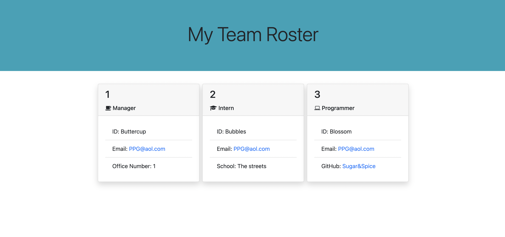

# Team-Profile-Generator

## Description

This application was created to generate a team profile based on user input using the Inquirer module from Node.js and displaying the information on a newly created html page with a style sheet. This project demonstrates use of OOP using Jest.

### Screenshot and Video

